# FeelIT

Modern accessibility-centered haptic application for tactile 3D object exploration, Braille reading, and controlled desktop-style interaction.

## Overview

FeelIT is a modernization of an accessibility project originally developed by Felipe Santibanez during his Electronic Engineering studies in Concepcion, Chile. The project focuses on giving people with visual impairment a richer way to access shape, texture, spatial structure, and text through bounded tactile interaction rather than relying only on visual interfaces or audio narration.

The current repository is not a single long web page. It is a multi-workspace application with five dedicated routes:

- `/object-explorer`
- `/braille-reader`
- `/haptic-desktop`
- `/haptic-workspace-manager`
- `/haptic-configuration`

The shipped baseline already provides real 3D workspace rendering across the spatial modes, a null-safe no-device execution path with pointer emulation, a scene-native object session launcher, scene-native Braille controls, bundled public-domain reading and audio assets, curated 3D demo assets, a structured `haptic_workspace` system that prepares the Haptic Desktop for larger external libraries, and a dedicated haptic-configuration route that separates the active fallback runtime from vendor SDK and bridge readiness. On the 3D import side, FeelIT now ships server-side local-upload validation, backend-derived staging guidance, and bundle-aware local `glTF` intake that can resolve sidecar buffers or textures when the user selects the main model together with its required resources. It also ships a native-bridge bootstrap surface: toolchain diagnostics, a PowerShell bridge bootstrap script, a JSON-based bridge probe contract, and a compiled scaffold that proves the bridge workflow can be configured and built locally before the vendor-specific device loop is fully implemented. The vendor-aware bridge layer now has two concrete levels: the Force Dimension DHD path can load the runtime library and enumerate devices when a compatible SDK runtime is present, while the OpenHaptics path can now load the HD runtime library set, attempt a conservative default-device open, and report capability channels inferred from exported HDAPI surfaces without yet claiming live scene-coupled force rendering. FeelIT now also emits dry-run pilot command payloads for the first bounded haptic primitives, records whether the current native bridge boundary can acknowledge them, and now crosses one step further into bounded native execution for both the OpenHaptics button-actuation pilot and the Force Dimension rigid-surface pilot in explicit no-force safety mode. The runtime also exposes a normalized runtime-feature schema that separates stable cross-backend features from vendor-specific evidence, and the configuration route now stages that material through explicit review lanes, a native spotlight, execution coverage, and a first runtime-query frontier so the operator can move from immediate diagnosis into deeper contract or bridge detail without reading the full page wall every time.

## Problem Framing

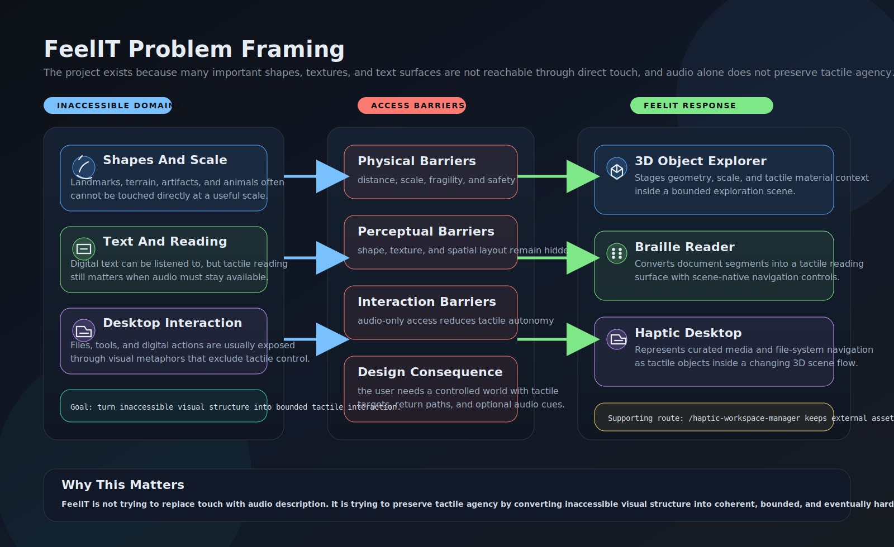

The core problem is not only that some information is visual. It is that many relevant objects, surfaces, and workflows are physically inaccessible, too large, too distant, too fragile, or too dependent on visual metaphors. FeelIT responds by converting those inaccessible domains into bounded tactile interaction worlds that can later be connected to real haptic hardware.

## Motivation

- Many objects worth understanding cannot be directly touched: landmarks, terrain, animals, cultural artifacts, and scaled structures.
- Audio helps, but audio alone does not preserve tactile agency for users who want to read, inspect shape, or navigate structured content through touch.
- Braille reading should remain possible without monopolizing the audio channel.
- Desktop interaction for blind users should not depend only on flat visual UI metaphors or voice prompts when a tactile scene could provide a more structured access path.
- A modern rebuild also needs methodological honesty: the verified legacy baseline was strongest in Braille, while the richer 3D explorer and haptic desktop are deliberate modernization work.

## Process And Interaction Flow


The mode map shows the five routed workspaces and how each one owns a different part of the accessibility problem: 3D object staging, Braille reading, haptic desktop interaction, workspace authoring, and haptic-runtime configuration.


The Braille pipeline shows a representative runtime path that is already implemented today: a scene-native library launcher selects content, the API clips a bounded segment, the Braille translator generates positioned cells, and the browser realizes them as a tactile 3D reading world with in-scene controls.

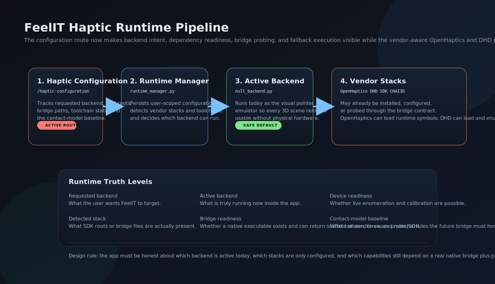

The runtime pipeline shows the new configuration route, the runtime manager, the active visual fallback backend, and the vendor stacks that can already be tracked for dependency readiness before the native bridge is live.

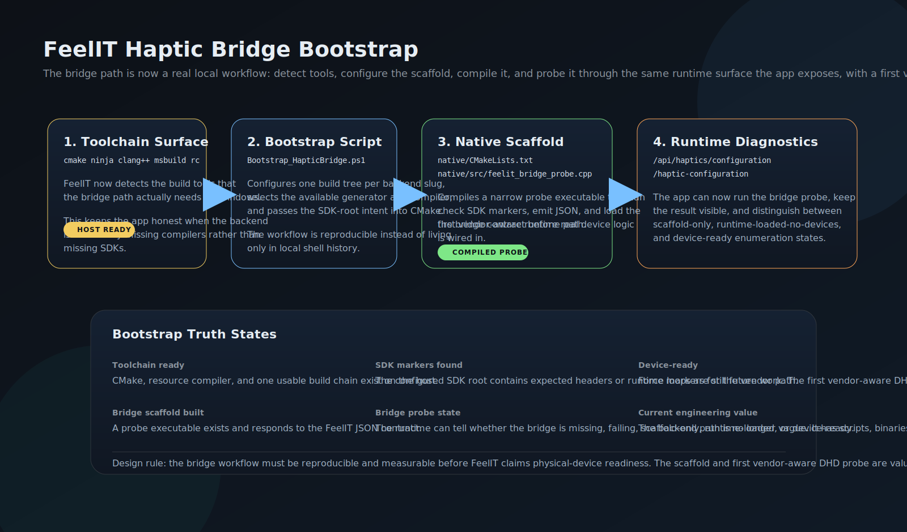

The bridge bootstrap flow shows the toolchain, script, native scaffold, and probe contract that now turn the haptic backend path into a reproducible local engineering workflow rather than a purely conceptual future note.

## Architecture


FeelIT uses a shared FastAPI backend, a shared Three.js scene runtime, an explicit haptic runtime manager, a null-safe fallback backend, and route-specific frontend modules. The architecture is intentionally release-governed: diagrams, README content, help text, and methodological history are all expected to move with the real shipped state rather than drifting behind it.

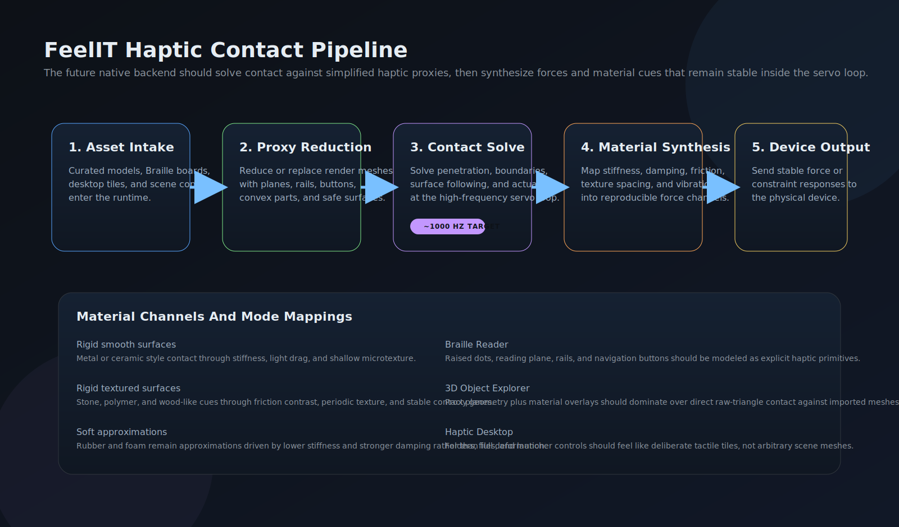

The contact pipeline captures the current design rule for future native hardware: proxy-first collision geometry, servo-loop contact solving, and material rendering through controlled force channels rather than naive raw-mesh contact.

## KPI Targets

- Blind-first operability: major interaction paths should be available from scene-native tactile targets rather than only from surrounding browser controls.
- Tactile reading continuity: document sessions should support bounded reading, page movement, segment movement, and reliable return paths inside the same 3D world.
- No-device viability: the application should remain runnable, inspectable, and testable without a physical haptic device attached.
- Workspace coherence: galleries, file browser scenes, and opened-content scenes should preserve clear return semantics and stable viewpoint behavior.
- Asset accessibility breadth: the bundled demo content should cover multiple object, text, and audio examples without violating repository-size constraints.
- Modernization traceability: the repository should clearly separate verified legacy behavior from new engineering scope, with current docs and SVGs always matching the runtime.

## Current Measured State

| Indicator | Current State |
|---|---|
| Routed workspaces | `5` |
| Spatial routes with a real 3D primary pane | `3` |
| Bundled 3D demo models | `14` |
| Bundled model formats | `obj`, `stl`, `gltf`, `glb` |
| Bundled public-domain documents | `5` |
| Bundled public-domain audio samples | `4` |
| Bundled reading-source formats | `txt`, `html`, `epub` |
| Local multi-file bundle intake | bundle-aware `gltf` sidecar resolution with explicit main-file selection |
| Public port | `8101` |
| Release-synced version | `2.18.006` |
| Haptic backend candidates tracked | `4` |
| Native bridge bootstrap surface | toolchain diagnostics + PowerShell bootstrap + JSON probe scaffold |
| Verified legacy baseline | Braille loading and conversion with optional Falcon-class haptics |
| Current validation surface | `112` automated tests passing plus browser smoke validation across the `5` routed pages |
| GitHub validation baseline | GitHub Actions runs unit/API validation plus browser smoke on pushes and pull requests |

## Current Frontend Views

The current README-facing screenshots use the tracked current-facing image set under `docs/png`, synchronized from the curated browser-smoke capture workflow. Braille now keeps two explicit capture states in that workflow: the library launcher and the reading world.

### 3D Object Explorer

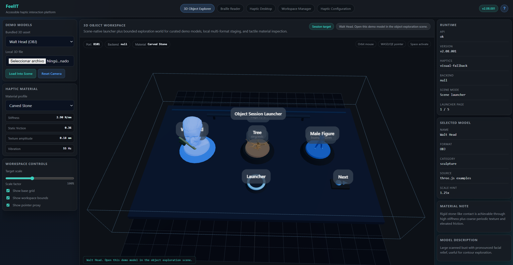

This route stages curated demo models and local uploads inside a bounded exploration world. It exposes backend-driven upload validation, scale guidance derived from geometry bounds, explicit main-file selection when several supported local models are selected together, and bundle-aware local `glTF` intake when sidecar resources are selected together with the main model.

### Braille Reader Launcher

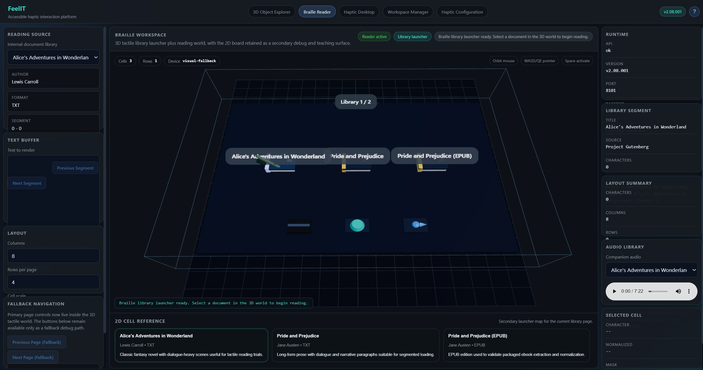

The launcher scene is the blind-first entry point for the reading workflow. It lets the user choose bundled public-domain documents directly from tactile targets inside the 3D world before entering the reading surface.

### Braille Reader Session

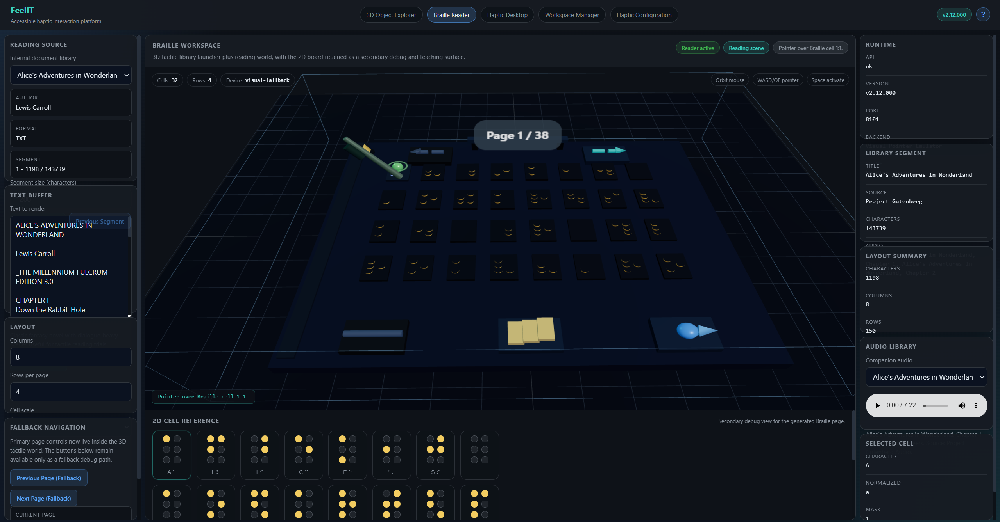

The reading world renders the active Braille segment on a bounded tactile board and keeps scene-native navigation controls in the same space, so the user can move through the document without dropping back to a purely outer browser UI.

### Haptic Desktop

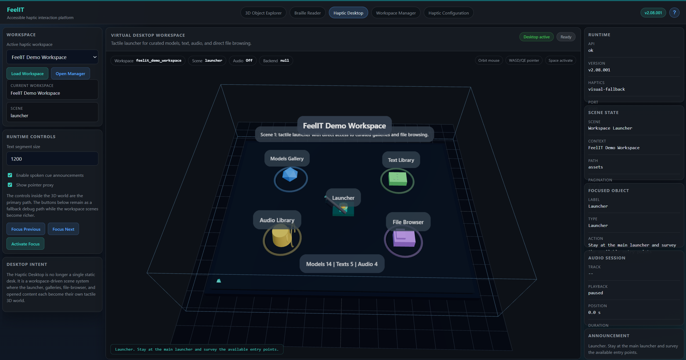

The desktop route is a controlled tactile launcher and gallery system rather than a generic file tree alone. It moves between launcher, galleries, typed file-browser scenes, detail plaques, and opened content scenes for models, text, and audio.
It now also exposes a compact `Navigation Trail` panel so the current scene ancestry stays readable while the user moves between launcher, gallery, browser, detail, and opened-content states.

### Haptic Workspace Manager

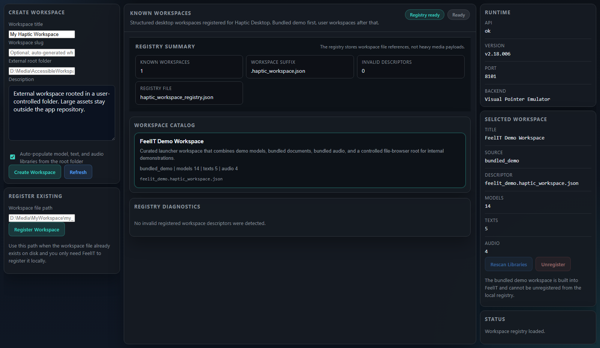

The manager route is the authoring and registry surface for structured `haptic_workspace` descriptors. It helps define curated external roots without exposing uncontrolled raw-path details as the primary UX.

### Haptic Configuration

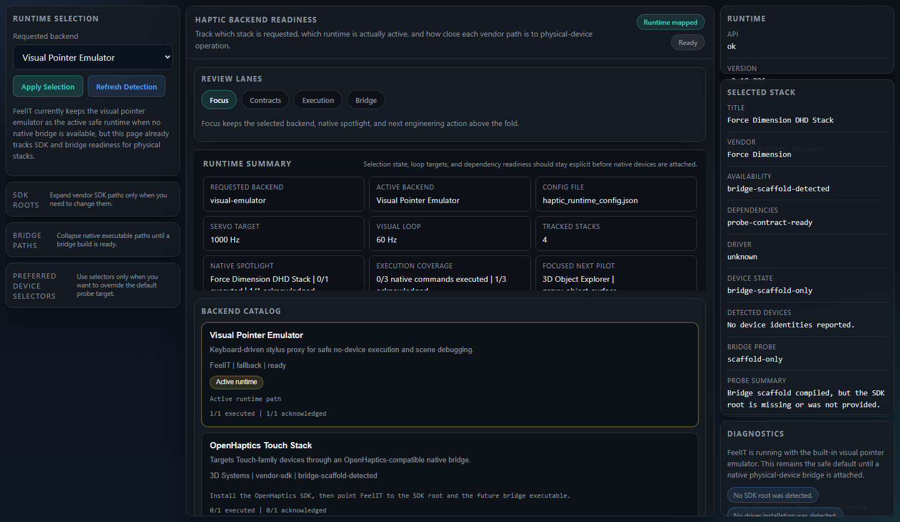

The configuration route makes the haptic backend problem explicit. It now opens in a focused review lane, keeps advanced SDK or bridge path inputs collapsed until needed, and shows requested backend intent, active fallback state, a native spotlight summary, execution coverage, the focused backend's next pilot, vendor SDK readiness, bridge diagnostics, preferred device selectors, reported vendor capability channels, normalized runtime features, verified versus inferred feature evidence, runtime-query frontiers, the backend-aware contact rollout, the dry-run pilot command payloads that a native bridge should eventually accept, and whether the current bridge boundary can already acknowledge them or execute bounded pilots safely. The backend catalog also distinguishes active runtime, inspector focus, and native spotlight as separate states instead of blending them into one ambiguous emphasis.

## Scope And Current Status

### Current Workspaces

- `3D Object Explorer`: starts from a scene-native object-session launcher, opens bounded exploration scenes for curated or local `OBJ`, `STL`, `glTF`, and `GLB` geometry, validates local uploads in the backend before staging, derives workspace-scale guidance from geometry bounds, supports explicit main-file selection for local bundles, and resolves local `glTF` sidecar bundles when the required files are selected together.
- `Braille Reader`: starts from a scene-native 3D library launcher, loads bounded document segments, and renders a tactile Braille world with in-scene navigation controls.
- `Haptic Desktop`: moves between a launcher, paginated galleries, a typed file browser rooted in the bundled assets tree or a user workspace, detail plaques, and opened scenes for models, text, and audio, with server-side browser pagination for larger external roots and an explicit `Navigation Trail` summary that keeps the current scene ancestry visible.
- `Haptic Workspace Manager`: creates and registers structured `haptic_workspace` descriptors rooted in external folders, surfaces registry diagnostics when registered descriptors are missing or invalid, defaults to descriptor-label views instead of exposing absolute local paths, and now supports unregister, library rescan, plus conservative invalid-descriptor repair actions.
- `Haptic Configuration`: tracks the requested runtime backend, the currently active fallback backend, the current native spotlight candidate, vendor SDK roots, native bridge paths, preferred device selectors, build-tool readiness, the compiled bridge probe state, the OpenHaptics default-device probe path, the Force Dimension runtime-enumeration path, reported vendor capability channels, normalized runtime features, verified versus inferred feature evidence, runtime-query frontiers, execution coverage across bounded pilots, and the current contact or material-rendering baseline that the future physical backend must respect while staging the page into explicit Focus, Contracts, Execution, and Bridge review lanes.
- FeelIT now also ships an explicit scene-to-backend contract baseline so each routed spatial mode declares which tactile primitives, event transitions, telemetry fields, return-flow expectations, and material channels a future native backend must honor. That contract is backed by a reusable primitive-family catalog and a backend-readiness matrix that clarifies which stacks are still diagnostic-only and which ones are closer to consuming real scene semantics.
- The same configuration route now computes a backend-aware contact rollout plan, so OpenHaptics, Force Dimension, CHAI3D, and the visual emulator each expose one bounded pilot primitive, required force channels, required runtime features, coverage alignment against currently reported backend capabilities, and the next engineering step toward scene-coupled haptics.
- FeelIT now also emits dry-run pilot command payloads for those bounded primitives, so the runtime can describe what a native bridge should consume before a full scene-wide force loop exists. Those payloads already include transport assumptions, force-model summaries, safety envelopes, telemetry expectations, and missing runtime features per backend-specific pilot.
- Native capability reasoning now has a shared normalized feature schema, so rollout planning no longer depends only on vendor-specific strings when it decides whether a backend is aligned, partial, or still blocked.
- The native bridge now acknowledges those bounded pilot payloads across the native-sidecar paths, and the OpenHaptics button-actuation plus Force Dimension rigid-surface paths now execute one first bounded pilot step each in a clamped no-force mode. That makes the bridge-side integration gap more explicit without pretending that full force execution or scene ownership already exists.

### Legacy Boundary

The preserved legacy archive in `legacy/Registro Software` most strongly verifies the Braille reading lineage: text-file loading, character-level Braille conversion, OpenGL-based visualization, and optional Falcon-class haptic interaction. The current object explorer, haptic desktop, and multi-route browser workbench are modernization work, not claims about a fully preserved legacy implementation.

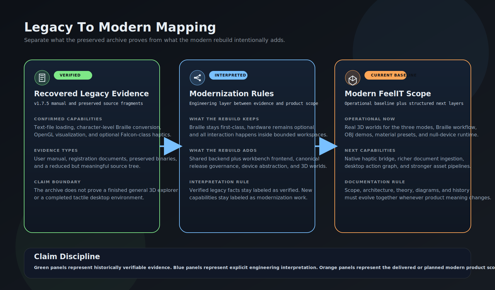

### Current Boundaries

- no native physical haptic backend is attached yet, although a dedicated configuration route now tracks requested backends, SDK roots, bridge paths, toolchain readiness, and contact-model assumptions
- the shipped bridge system now includes a vendor-aware Force Dimension DHD probe that can load the runtime library and enumerate devices plus a vendor-aware OpenHaptics probe that can load the HD runtime library set, perform a conservative default-device open attempt, and report stack-level capability channels plus normalized runtime features, but CHAI3D still remains a scaffold-level probe path
- no current pilot path drives real force output, calibration, homing, or a live scene-coupled servo loop; the shipped OpenHaptics and Force Dimension pilot execution milestones remain bounded no-force bridge steps rather than full actuation
- 3D asset import now has server-side validation, staging guidance, explicit local-bundle main-file selection, and bundle-aware local `gltf` sidecar resolution, but it still lacks a full server-side preprocessing or repair pipeline
- document compatibility is currently limited to bundled `txt`, `html`, and `epub`
- the workspace manager now covers the core descriptor lifecycle, but it is still not a full authoring suite with preview, deep editing, or asset-level repair workflows
- the desktop flow already opens models, text, and audio, but it is not yet a full desktop automation environment
- the current metrics are mostly engineering and delivery metrics, not yet a formal user-study outcome set
- vendor SDK detection now proves dependency readiness, OpenHaptics conservative default-device probing, Force Dimension device enumeration, and one first bounded no-force execution slice per shipped native pilot, and it now distinguishes symbol-derived-only evidence from runtime-query-ready or runtime-queried frontiers, but it still does not prove live device control, calibration completion, homing, or scene-coupled force output

## Technical Quick Start

### 1. Create the environment

```powershell
python -m venv .venv
.venv\Scripts\Activate.ps1
pip install -r requirements.txt
```

### 2. Run FeelIT

```powershell
python run_app.py
```

Open one of the routed workspaces:

- `http://127.0.0.1:8101/object-explorer`
- `http://127.0.0.1:8101/braille-reader`
- `http://127.0.0.1:8101/haptic-desktop`
- `http://127.0.0.1:8101/haptic-workspace-manager`
- `http://127.0.0.1:8101/haptic-configuration`

## Validation

### Automated tests

```powershell
python -m pytest tests -v
```

### Repo-managed validation

```powershell
python scripts\validate_repo.py --mode lint
python scripts\validate_repo.py --mode unit
python scripts\validate_repo.py --mode full --install-browser
python scripts\validate_repo.py --mode lint-baseline
```

The repo-managed validator keeps local execution aligned with the GitHub Actions baseline. `lint` runs the currently enforced Ruff rule set, `unit` runs the Python test suite, `smoke` runs the browser scene smoke workflow, `full` runs the enforced baseline in sequence, and `lint-baseline` reports the remaining staged Ruff debt profile. The current enforced Ruff baseline intentionally ignores the historical line-length backlog while requiring import order, unused-import cleanup, and other non-length structural rules to stay clean.

### Browser smoke validation

```powershell
pip install -e ".[dev]"
python -m playwright install chromium
python scripts\browser_scene_smoke.py --sync-docs-png
```

To refresh the tracked visual baseline, synchronize the README-facing screenshots, and freeze a release snapshot set:

```powershell
python scripts\browser_scene_smoke.py --sync-docs-png --archive-version <released-version>
```

The curated captures are expected to come from stable canonical route states so the visual history does not over-report change because of idle animation or leftover post-validation state. Braille specifically archives separate launcher and reading-world captures instead of collapsing them into one generic route screenshot.

GitHub Actions now runs lint, unit/API validation, and browser smoke automatically on pushes and pull requests targeting `main` or `develop`.

### Native bridge diagnostics

```powershell
python scripts\haptic_bridge_diagnostics.py
.\scripts\Bootstrap_HapticBridge.ps1 -Backend openhaptics-touch -Build
```

These commands dump the current backend and toolchain diagnostic state and compile the native bridge scaffold for the requested backend target.

## Runtime Surface

### Public metadata and health

- `GET /api/health`
- `GET /api/meta`
- `GET /api/modes`
- `GET /api/device/status`
- `GET /api/haptics/configuration`
- `POST /api/haptics/configuration`

### Object and material staging

- `GET /api/materials`
- `GET /api/demo-models`
- `POST /api/models/validate-local-upload`
- `POST /api/models/validate-local-bundle`

### Braille and library services

- `POST /api/braille/preview`
- `GET /api/library/documents`
- `GET /api/library/documents/{slug}`
- `GET /api/library/audio`

### Haptic workspace services

- `GET /api/haptic-workspaces`
- `GET /api/haptic-workspaces/{slug}`
- `GET /api/haptic-workspaces/{slug}/browse?path=&page=0&page_size=6`
- `GET /api/haptic-workspaces/{slug}/text-file`
- `GET /api/haptic-workspaces/{slug}/raw-file`
- `POST /api/haptic-workspaces/create`
- `POST /api/haptic-workspaces/register`

## Bundled Demo Content

### 3D models

FeelIT ships `14` lightweight 3D demos across `OBJ`, `STL`, `glTF`, and `GLB`, including `WaltHead.obj`, `Cerberus.obj`, `tree.obj`, `tactile_bridge.stl`, `orientation_marker.gltf`, and `navigation_puck.glb`. The full catalog and provenance are documented in [Asset Sources](docs/asset_sources.md).

### Reading library

The internal public-domain library ships `5` bundled documents:

- `Alice's Adventures in Wonderland`
- `Pride and Prejudice`
- `Pride and Prejudice (EPUB)`
- `The Raven`
- `Feeding the Mind`

It also ships `4` companion audio samples from public-domain sources. See [Library Catalog](docs/library_catalog.md) and [Asset Sources](docs/asset_sources.md).

### Workspace system

The bundled demo workspace lives at `app/static/assets/workspaces/feelit_demo.haptic_workspace.json` and mirrors the full internal demo catalog so Haptic Desktop galleries do not hide bundled content behind a partial subset.

## Build And Distribution

### PyInstaller executable

```powershell
.\Build_PyInstaller.ps1
```

### Inno Setup installer

After building the executable:

```powershell
.\installer\Build_InnoSetup.ps1
```

## Documentation Index

- [Scope And Motivation](docs/scope_and_motivation.md)
- [Architecture](docs/architecture.md)
- [Implementation Gap Audit](docs/implementation_gap_audit.md)
- [Haptic Runtime Design](docs/haptic_runtime_design.md)
- [Haptic Bridge Bootstrap](docs/haptic_bridge_bootstrap.md)
- [Material Profiles](docs/material_profiles.md)
- [Library Catalog](docs/library_catalog.md)
- [Asset Sources](docs/asset_sources.md)
- [Theory](docs/theory.md)
- [Development History](docs/development_history.md)
- [User Guide](docs/user_guide.md)
- [References](docs/references.md)
- [Legacy Mapping](docs/legacy_mapping.md)
- [Artifacts Archive](artifacts/README.md)

## License

MIT for the modern code in this repository. Legacy materials remain preserved for historical and research context.
