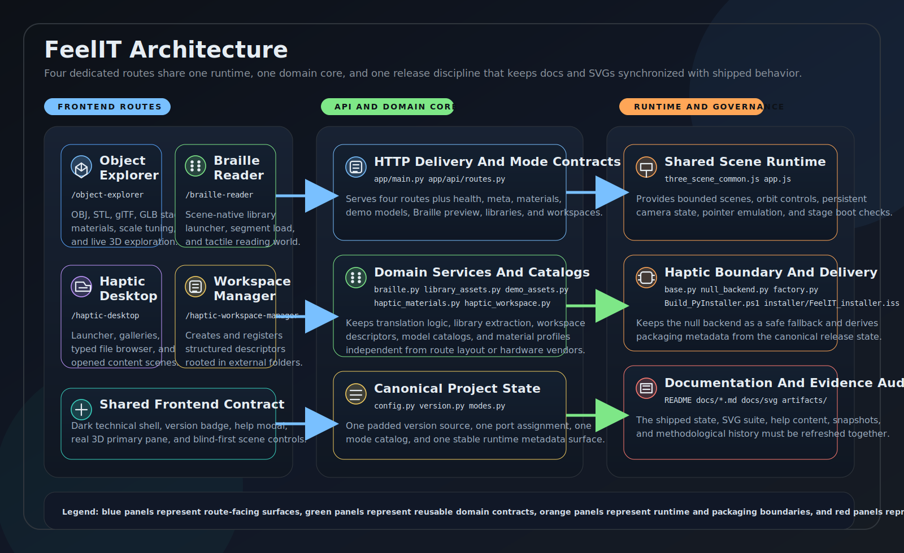

# FeelIT

Modern accessibility-centered haptic application for tactile 3D object exploration, Braille reading, and future haptic desktop interaction.



## Overview

FeelIT is a modernization of a university-era accessibility project focused on giving people with visual impairment a richer way to access shape, texture, and text through bounded haptic interaction. The modern repository is organized as a multi-workspace application with three dedicated routes rather than a single scrolling page:

- `/object-explorer`
- `/braille-reader`
- `/haptic-desktop`

The current implementation provides real 3D workspace rendering across all three modes, a stylus-style pointer emulator for no-device execution, scene-native tactile controls in the Braille world, visible startup diagnostics for failed workspace boot, bundled OBJ demo assets, a bundled public-domain reading and audio library, tactile material presets grounded in current desktop-haptics capabilities, and a null-hardware-safe runtime foundation for future physical device integration.

## Current Version

`0.4.0`

## Public Port

`8101`

## Legacy Baseline

The preserved legacy project in `legacy/Registro Software` demonstrates a text-file to Braille workflow with optional haptic interaction using a Novint Falcon-class device and `hdl.dll`. That recoverable baseline is documented in:

- [Legacy Mapping](docs/legacy_mapping.md)
- [Development History](docs/development_history.md)

## Current Workspaces

### 3D Object Explorer

Dedicated workspace for staging real OBJ models on an exploration plinth, selecting tactile material presets, and preparing a bounded exploration context in a live 3D scene.

### Braille Reader

Operational workspace that translates text into Braille cells, lays them out on a bounded reading surface, and renders that reading surface as a 3D world with orientation cues, scene-native page controls, and an auxiliary 2D inspection board.

### Haptic Desktop

Prototype workspace for shape-coded action objects that stand in for folders, media, settings, and other desktop interactions inside a bounded 3D desktop scene.

## Bundled Demo Assets

FeelIT now ships local OBJ demo assets for exploratory testing:

- `WaltHead.obj`
- `tree.obj`
- `male02.obj`
- `female02.obj`
- `Cerberus.obj`
- `ninjaHead_Low.obj`
- `closed_book.obj`
- `open_book.obj`
- `terrain_peak.obj`
- `vase_lowpoly.obj`

These are exposed through `GET /api/demo-models` and documented in [Asset Sources](docs/asset_sources.md).

## Internal Reading Library

The Braille Reader now bundles an internal public-domain library with segmented loading support:

- `txt`: Alice's Adventures in Wonderland, Pride and Prejudice, Feeding the Mind
- `html`: The Raven
- `epub`: Pride and Prejudice
- companion audio: curated LibriVox / Project Gutenberg tracks

These are exposed through:

- `GET /api/library/documents`
- `GET /api/library/documents/{slug}`
- `GET /api/library/audio`

See [Library Catalog](docs/library_catalog.md) and [Asset Sources](docs/asset_sources.md).

## Quick Start

### 1. Create the environment

```powershell
python -m venv .venv
.venv\Scripts\Activate.ps1
pip install -r requirements.txt
```

### 2. Run FeelIT

```powershell
python run_app.py
```

Open one of the mode routes:

- `http://127.0.0.1:8101/object-explorer`
- `http://127.0.0.1:8101/braille-reader`
- `http://127.0.0.1:8101/haptic-desktop`

### 3. Run tests

```powershell
python -m pytest tests -v
```

### 4. Optional browser smoke test for the 3D scenes

```powershell
pip install -e ".[dev]"
python -m playwright install chromium
python scripts\browser_scene_smoke.py
```

## Runtime Capabilities

- FastAPI backend on port `8101`
- multi-page frontend shell aligned to the reference workbench style
- real 3D workspace rendering in all three user modes
- stylus-style pointer emulation with hover and activation feedback
- visible startup diagnostics when a workspace fails to initialize
- bundled OBJ demo assets plus local OBJ upload for staging
- bundled public-domain document and audio library for Braille sessions
- tactile material catalog exposed at `GET /api/materials`
- demo model catalog exposed at `GET /api/demo-models`
- document library catalog exposed at `GET /api/library/documents`
- document segment loading exposed at `GET /api/library/documents/{slug}`
- audio catalog exposed at `GET /api/library/audio`
- Braille preview API at `POST /api/braille/preview`
- bounded 3D Braille world with scene-native page controls plus auxiliary inspection board
- prototype 3D desktop scene with distinct tactile object families
- null haptic backend abstraction for no-device execution
- shared runtime metadata for version, port, and device state

## Documentation

- [Scope And Motivation](docs/scope_and_motivation.md)
- [Architecture](docs/architecture.md)
- [Implementation Gap Audit](docs/implementation_gap_audit.md)
- [Material Profiles](docs/material_profiles.md)
- [Library Catalog](docs/library_catalog.md)
- [Asset Sources](docs/asset_sources.md)
- [Theory](docs/theory.md)
- [Development History](docs/development_history.md)
- [User Guide](docs/user_guide.md)
- [References](docs/references.md)
- [Legacy Mapping](docs/legacy_mapping.md)

## Version Workflow

The canonical application version lives in `app/core/version.py`.

To bump the version and synchronize derived metadata:

```powershell
python scripts\bump_version.py patch --summary "Short release summary"
```

That workflow is expected to update:

- canonical version metadata
- README current version
- development history entry
- PyInstaller version metadata
- Inno Setup version metadata
- impacted project documentation

## Build And Distribution

### PyInstaller executable

```powershell
.\Build_PyInstaller.ps1
```

### Inno Setup installer

After building the executable:

```powershell
.\installer\Build_InnoSetup.ps1
```

## License

MIT for the modern code in this repository. Legacy materials remain preserved for historical and research context.
