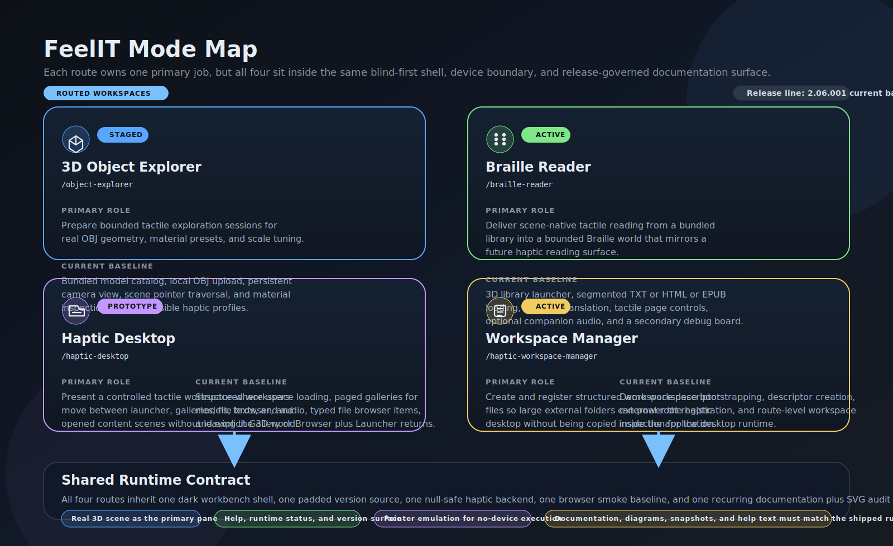
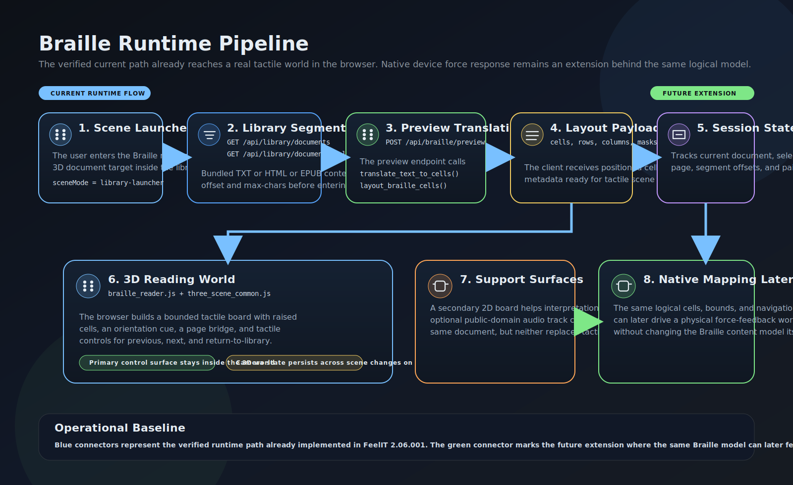

# FeelIT Architecture

## Purpose

This document defines the current system architecture for the modern FeelIT rebuild, including the new haptic-runtime configuration surface and the current design baseline for future native device integration.

## Architectural Priorities

- preserve the verified Braille legacy path
- isolate hardware-specific logic behind a haptic backend abstraction and an explicit runtime manager
- expose separate user workspaces for different interaction goals
- render the actual spatial workspace for haptic-facing modes
- keep the application usable when no physical haptic device is attached

## High-Level View

## Mode Map

This mode map should always reflect the current shipped route set, current maturity of each route, and the current blind-first interaction contract.

## Braille Runtime Pipeline

The Braille pipeline diagram should stay aligned with the real reading workflow, including the current scene-native library launcher, segment loading, preview translation, and reading-world controls.

## Frontend Architecture

The frontend follows the workbench pattern used by the stronger reference repositories.

### Shared Shell

All user workspaces share:

- top application header
- persistent mode navigation
- runtime version badge
- help modal pattern
- dark technical visual language
- a real 3D scene as the primary workspace for spatial modes
- module-based frontend bootstrap through the shared shell helper
- visible boot diagnostics when runtime initialization fails
- workspace-driven scene transitions for Haptic Desktop

Current shared files:

- `app/static/css/style.css`
- `app/static/js/app.js`
- `app/static/js/model_loading.js`
- `app/static/js/three_scene_common.js`
- `app/static/vendor/three/three.core.js`
- `app/static/vendor/three/three.module.js`
- `app/static/vendor/three/OrbitControls.js`

### Dedicated Mode Routes

The user-facing interface is separated into dedicated routes:

- `/object-explorer`
- `/braille-reader`
- `/haptic-desktop`
- `/haptic-workspace-manager`
- `/haptic-configuration`

This avoids collapsing incompatible workflows into one long page.

### 3D Workspace Rule In FeelIT

The object explorer, Braille reader, and haptic desktop each render an actual 3D world as the main pane:

- the object explorer stages real `OBJ`, `STL`, `glTF`, and `GLB` meshes inside a bounded scene
- the object explorer now begins from a scene-native object-session launcher and then opens exploration scenes with in-world launcher and material controls
- the Braille reader starts from a scene-native tactile library launcher and then renders the tactile board as raised 3D geometry with scene-native navigation controls
- the desktop mode renders a workspace-driven launcher, galleries, a server-paginated typed file browser, detail plaques, and opened content scenes
- the shared pointer emulator behaves as a stylus-like proxy when no hardware device is attached

Auxiliary 2D views are secondary and are only used when they help interpretation or debugging.

### Mode-Specific Frontend Modules

- `app/static/object_explorer.html`
- `app/static/braille_reader.html`
- `app/static/haptic_desktop.html`
- `app/static/haptic_workspace_manager.html`
- `app/static/haptic_configuration.html`
- `app/static/js/object_explorer.js`
- `app/static/js/braille_reader.js`
- `app/static/js/haptic_desktop.js`
- `app/static/js/haptic_workspace_manager.js`
- `app/static/js/haptic_configuration.js`
- `app/static/vendor/three/OBJLoader.js`
- `app/static/vendor/three/STLLoader.js`
- `app/static/vendor/three/GLTFLoader.js`
- `app/static/vendor/three/BufferGeometryUtils.js`

## API Layer

The API layer provides the public contract between frontend workspaces and domain services.

Current responsibilities:

- health metadata
- public application metadata
- mode catalog
- material profile catalog
- demo model catalog
- bundled document library catalog
- bundled document segment loading
- bundled audio library catalog
- haptic workspace catalog, server-paginated browsing, text loading, raw file serving, and descriptor management
- haptic backend status
- haptic runtime configuration, backend selection intent, and dependency diagnostics
- Braille preview translation

Current file:

- `app/api/routes.py`

## Core Domain Layer

The core domain layer contains logic that should remain independent of any frontend layout or hardware vendor.

Current responsibilities:

- application configuration
- canonical version metadata
- mode catalog
- Braille translation
- Braille preview layout
- haptic material profiles
- bundled demo asset catalog
- bundled public-domain document and audio catalogs
- plain-text, HTML, and EPUB extraction for the internal reading library
- freshness-aware text extraction caching for external workspace documents
- haptic workspace descriptor parsing, registry, and server-paginated filesystem browsing
- haptic contact-model and material-rendering baseline for future native hardware
- scene-to-backend haptic contract baseline for routed tactile worlds
- backend-aware pilot rollout planning and bridge-facing pilot profiles for first scene-coupled contact milestones

Current files:

- `app/core/config.py`
- `app/core/version.py`
- `app/core/modes.py`
- `app/core/braille.py`
- `app/core/haptic_materials.py`
- `app/core/demo_assets.py`
- `app/core/library_assets.py`
- `app/core/haptic_workspace.py`
- `app/core/haptic_feedback_design.py`
- `app/core/haptic_scene_contracts.py`
- `app/core/haptic_contact_rollout.py`

## Haptic Runtime Layer

The haptic runtime layer wraps the active device backend and now exposes a first configuration and diagnostics surface for future native stacks.

Current behavior:

- uses a visual pointer-emulator fallback for no-device execution
- exposes stable device status metadata
- persists requested-backend intent plus SDK or bridge overrides in a user-scoped runtime config
- detects native build-tool availability for the bridge path
- reports the difference between the active fallback backend and the vendor stacks that are merely detected or configured
- probes the native bridge executable when one is configured or auto-detected
- keeps hardware assumptions out of the API and core domain logic while still surfacing the future contact-model baseline

Current files:

- `app/haptics/base.py`
- `app/haptics/bridge_probe.py`
- `app/haptics/null_backend.py`
- `app/haptics/factory.py`
- `app/haptics/runtime_manager.py`
- `app/haptics/toolchain.py`

## Page Delivery

FastAPI serves the mode pages directly:

- root redirects to `/braille-reader`
- each mode route returns a dedicated static HTML document
- all static assets are served under `/static`

Current file:

- `app/main.py`

## Current Runtime Flow

1. `run_app.py` launches Uvicorn.
2. `app.main` creates the FastAPI application and starts the haptic runtime manager.
3. The runtime manager selects the active fallback backend and loads persisted SDK or bridge configuration for future physical stacks.
4. The user opens one of the dedicated mode routes.
5. The shared frontend shell requests `/api/health` and `/api/meta`.
6. The object explorer additionally calls `/api/materials` and `/api/demo-models`.
7. The Braille reader additionally calls `/api/library/documents` and `/api/library/audio`.
8. Haptic Desktop calls `/api/haptic-workspaces` and resolves the selected `haptic_workspace`.
9. Haptic Configuration calls `/api/haptics/configuration` to surface the requested backend, active runtime, dependency diagnostics, and contact-model baseline.
10. Each spatial workspace instantiates the shared stylus-like pointer proxy and bounded scene runtime.
11. The object explorer resolves the bundled demo-model catalog into a scene-native object-session launcher, then stages the selected `OBJ`, `STL`, `glTF`, or `GLB` mesh plus tactile material context on a visible exploration plinth.
12. The Braille reader loads the bundled library catalog, opens a document from a scene-native launcher, requests `/api/braille/preview`, and realizes the response as a 3D tactile board with in-scene page, segment, and library-return controls.
13. Haptic Desktop moves between launcher, gallery, file-browser, detail, and opened-content scenes using workspace-driven payloads.
14. File-browser requests now page server-side so larger external roots do not have to be materialized in one frontend payload.
15. File-browser entries use kind-specific tactile forms and dispatch supported files directly into the corresponding runtime scene.
16. Workspace text files reuse freshness-aware extracted-text cache state while the reading scene pages through the same source document.
17. Opened desktop scenes expose `Gallery` or `Browser` returns to the exact origin context and `Launcher` for return to the workspace start scene.
18. Runtime and device status are reflected in the current workspace, while the configuration route keeps vendor-stack readiness explicit even before the native bridge exists.
19. The haptic-configuration route now also reports bridge-toolchain state and, when available, runs the compiled bridge-probe executable to verify the contract end to end.

## Future Extension Points

### 3D Object Explorer

Current baseline:

- real `OBJ`, `STL`, `glTF`, and `GLB` loading from local bundled assets
- local multi-format upload and client-side parsing for `OBJ`, `STL`, self-contained `glTF`, and `GLB`
- scene-native paged launcher for curated demo-model sessions
- bounded 3D scene with stylus-like pointer proxy
- visible exploration plinth and adaptive scene bounds
- tactile material preset selection plus in-scene material cycling and launcher return controls

Next additions:

- server-side validation and preprocessing for imported assets
- richer handling for non-self-contained `glTF` resources
- persistent model metadata
- native contact model once a hardware backend is attached

### Braille Reader

Current baseline:

- Braille translation API
- internal public-domain library with TXT, HTML, and EPUB extraction
- segmented document loading for bounded reading sessions
- scene-native 3D library launcher for blind-first document entry
- page slicing and 3D Braille board rendering
- scene-native previous and next tactile controls
- scene-native previous and next segment controls plus library return
- orientation rail and origin marker inside the reading world
- optional companion audio catalog surfaced beside the reading workflow
- selected-cell inspection and auxiliary 2D board

Next additions:

- richer document compatibility beyond the first supported formats
- richer layout constraints tied to device workspace assumptions

### Haptic Desktop

Current baseline:

- structured `haptic_workspace` descriptor format and bundled demo workspace
- dedicated manager route for creating and registering workspaces rooted in external folders
- launcher scene for curated models, texts, audio, and file browsing
- paginated gallery scenes for curated workspace content
- file-browser scene rooted in the configured workspace path with server-side pagination
- detail plaque scene with braille naming before content opening
- opened model, text, and audio scenes with scene-native return controls
- workspace manager surfaces descriptor labels and registry diagnostics without exposing absolute local paths by default

Next additions:

- richer workspace authoring tools and validation beyond the first JSON descriptor baseline
- audio naming and cue refinement tied to real user workflows
- assistive focus and activation rules tuned against real haptic-device constraints
- integration with native hardware and richer desktop action execution

### Haptic Configuration

Current baseline:

- dedicated route for runtime selection, SDK-root tracking, bridge-path tracking, and contact-model inspection
- explicit separation between requested backend and active fallback backend
- vendor-stack diagnostics for OpenHaptics, Force Dimension, and CHAI3D-oriented paths
- toolchain diagnostics for CMake, Ninja, clang++, MSBuild, Visual Studio, MSVC, and the Windows resource compiler
- native bridge scaffold plus JSON probe contract for early validation of the bridge path, with a vendor-aware OpenHaptics runtime loader and a vendor-aware Force Dimension runtime loader plus device enumerator
- frontend-facing summary of the current proxy-first collision baseline and material-rendering assumptions
- frontend-facing summary of the current scene-to-backend contract baseline, including primitive families, return-flow expectations, backend-readiness rows, bridge-facing telemetry expectations, and backend-specific pilot rollout steps

Next additions:

- extend the current OpenHaptics and Force Dimension probe coverage into controlled activation, and move CHAI3D beyond scaffold-level readiness
- live device enumeration and calibration diagnostics
- workspace-scale alignment and device-specific homing or status actions

## Packaging Architecture

The repository keeps local execution, standalone distribution, and installer generation inside the same project workflow through:

- `Build_PyInstaller.ps1`
- `build.spec`
- `installer/FeelIT_installer.iss`
